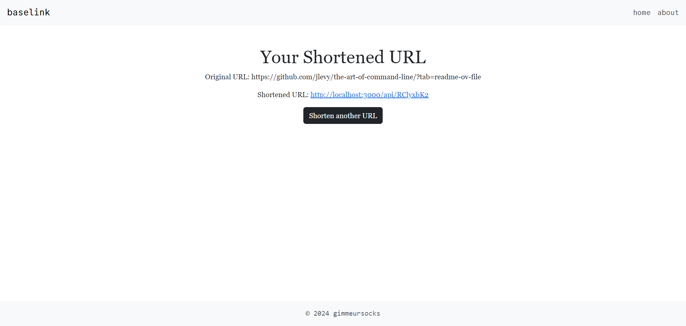

# BaseLink URL Shortener

A simple URL shortener built using Node.js, Express, and MySQL. It generates short Base64-encoded URLs and allows users to shorten and redirect long URLs.

## Features
- Shorten long URLs into Base64 strings
- Redirect shortened URLs to the original URLs
- Error handling for invalid URLs
- Configurable URL length

## Screenshots



## Requirements
- Node.js
- MySQL

## Setup

1. Clone the repository:
   ```bash
   git clone https://github.com/gimmeursocks/baselink-url-shortener.git
   cd baselink-url-shortener
   ```

2. Install dependencies:
   ```bash
   npm install
   ```

3. Setup environment variables:
   Create a `.env` file in the project root or refer to `.env.example`:
   ```bash
   cp .env.example .env
   ```
   Example `.env`:
   ```
   PORT=3000
   DB_HOST=localhost
   DB_USER=root
   DB_PASSWORD=your_password
   DB_NAME=url_shortener
   DB_PORT=3306
   SHORT_URL_LENGTH=8
   ```

4. Set up your MySQL database:
   Ensure your database is created and configured as per `.env` variables.

## Running the Application

- Start the application:
   ```bash
   npm start
   ```

- If you have `nodemon` installed globally, you can run in development mode:
   ```bash
   npm run dev
   ```